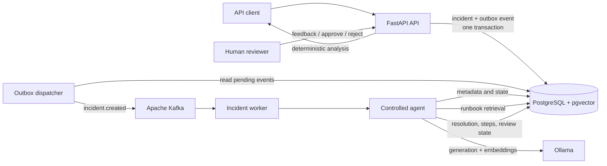
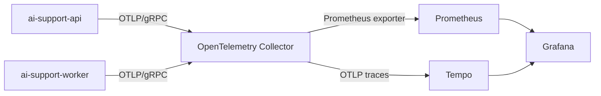
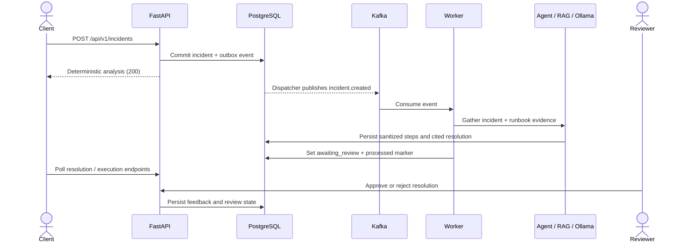
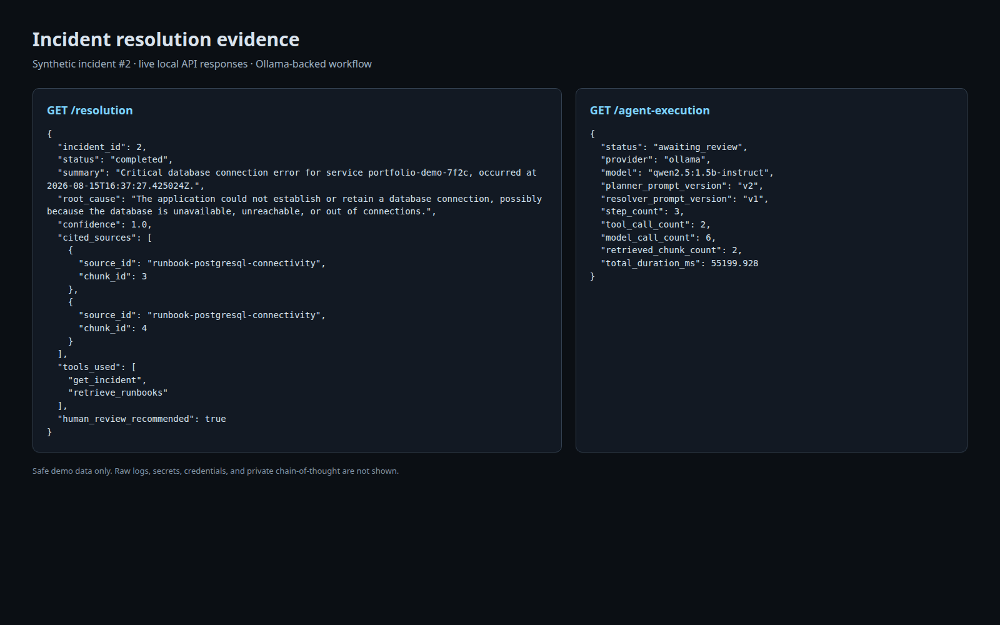
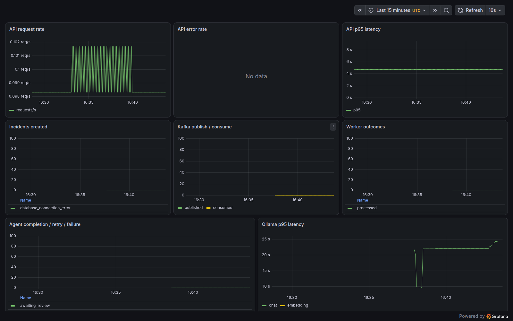
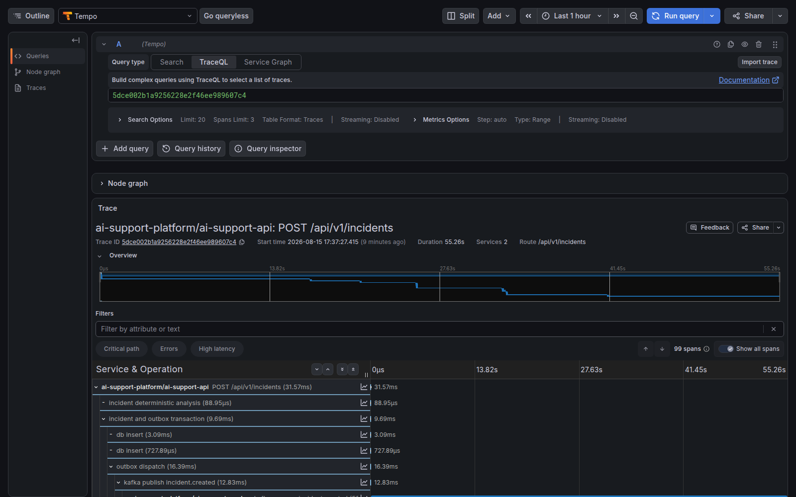

# AI Support Engineering Platform

[](https://www.python.org/)
[](https://fastapi.tiangolo.com/)
[](https://www.postgresql.org/)
[](https://kafka.apache.org/)
[](https://docs.docker.com/compose/)
[](https://kubernetes.io/)

An event-driven platform for deterministic incident intake and asynchronous,
retrieval-grounded AI analysis. It combines a FastAPI API, a transactional outbox,
Kafka workers, local Ollama inference, pgvector retrieval, auditable agent execution,
explicit human review, and OpenTelemetry-based observability.

> [!IMPORTANT]
> This repository is an engineering reference implementation, not a production
> deployment. The default topology is local, unauthenticated, and single-host. See
> [Production readiness](docs/production-readiness.md) before using real incident data.

## Navigation

[Overview](#overview) · [Key Features](#key-features) · [Architecture](#architecture) ·
[Incident Workflow](#incident-workflow) · [Observability](#observability) ·
[Quick Start](#quick-start) · [Technology Stack](#technology-stack) ·
[Project Structure](#project-structure) · [Testing](#testing) ·
[End-to-End Example](#end-to-end-example) · [Roadmap](#roadmap) ·
[Contributing](#contributing) · [License](#license)

Related documentation: [Kubernetes](docs/kubernetes.md),
[production readiness](docs/production-readiness.md), and [security](SECURITY.md).

## Overview

The API accepts an incident, applies deterministic classification, and commits the
incident and an `incident.created` outbox event in one PostgreSQL transaction. It
returns without waiting for Kafka, retrieval, or model inference. A background
dispatcher publishes acknowledged outbox events to Kafka, where an independently
running worker performs the controlled AI workflow.

The worker gathers incident metadata and runbook evidence through a fixed set of
read-only tools. Retrieval uses repository-owned runbooks, deterministic chunking,
Ollama embeddings, and a pgvector HNSW cosine index. A structured resolver persists
a cited resolution and moves the durable agent execution to `awaiting_review`.
Operators can then approve or reject it through explicit API operations.

The default Compose stack is self-contained: it does not require a cloud AI API,
external API key, or vendor-specific telemetry backend. PostgreSQL, Kafka, Ollama,
the OpenTelemetry Collector, Prometheus, Tempo, and Grafana remain inside the Compose
network; only FastAPI and Grafana are published to the host.

## Key Features

- **Incident intake** — validated FastAPI contracts and deterministic classification.
- **Async delivery** — atomic outbox records, Kafka, manual offsets, retries, and
  durable idempotency markers, resolution state, audit steps, and feedback.
- **Grounded RAG** — five versioned runbooks, idempotent ingestion, pgvector
  retrieval over 768-dimensional embeddings, and validated citations.
- **Controlled agent** — versioned prompts, structured output, bounded read-only
  tools and retries, sanitized audit records, and explicit human review.
- **Full-stack observability** — correlated JSON logs, W3C trace propagation,
  low-cardinality metrics, Tempo traces, and four provisioned Grafana dashboards.
- **Portable packaging** — hardened Distroless containers, Docker Compose, and a
  Helm chart with embedded-local and external-service deployment modes.
- **Delivery controls** — hash-locked dependencies, layered tests, migrations,
  CI security scans, SBOM generation, and versioned release artifacts.

## Architecture



The application and telemetry planes are intentionally separate. Telemetry is
best-effort: Collector, Prometheus, Tempo, or Grafana failure does not roll back an
incident or block the application plane.



### Delivery and failure semantics

The platform provides at-least-once delivery. Incidents and outbox records commit
atomically; broker failures leave events available for retry. The consumer uses
manual offsets, retryable failures seek back, and `processed_events.event_id` plus
unique execution/resolution records prevent duplicate durable outcomes. Agent steps
are persisted for restart recovery, and the resolution and `awaiting_review` state
commit before the Kafka offset. A crash before a step commit can repeat a read-only
provider call, so exactly-once model invocation is not claimed.

### Agent controls

The fixed registry contains six read-only tools: `get_incident`,
`retrieve_runbooks`, `search_similar_incidents`, `get_previous_resolutions`,
`get_incident_resolution_context`, and `summarize_evidence`.

There is no SQL, shell, filesystem, web, generic HTTP, Kubernetes, cloud,
credential, or remediation tool. The server enforces schemas, incident scope, size,
timeouts, repetition, and step/tool budgets. Final output requires incident metadata
and a runbook retrieval attempt; citations must match retrieved evidence. Missing
citable evidence caps confidence at `0.5` and requires escalation and human review.
Audit records store sanitized tool/evidence summaries and prompt/provider provenance,
not complete prompts, raw logs, secrets, reviewer identity, or chain-of-thought.

## Incident Workflow



Execution state and sanitized steps are durable. Clients poll the resolution and
execution endpoints; completed AI output waits in `awaiting_review` until approved
or rejected.

**System in action.** Live responses from a synthetic Ollama-backed incident show the grounded resolution, runbook citations, executed tools, and review state.

<p align="center">
  
</p>

## Observability

W3C context crosses the outbox record, Kafka headers, and consumer processing. Spans
cover API, publication, agent, retrieval, model, persistence, and offset operations;
JSON logs include trace, span, incident, event, and execution correlation IDs.

Metrics cover API latency/errors, incident classification, outbox and Kafka flow,
worker processing, agent/tool/model behavior, RAG retrieval and citations, review
outcomes, and database operations. An enforced label policy excludes unbounded
service names, IDs, offsets, raw incident text, prompts, and user input.

Grafana provisions Prometheus, Tempo, and four dashboards: **Platform Overview**,
**Kafka and Outbox**, **AI / RAG / Agent**, and **Operational Health**.

<p align="center">
  
</p>

The same 99-span, two-service trace connects the API transaction and outbox dispatch
to Kafka and asynchronous worker processing.

<p align="center">
  
</p>

The applications do not expose `/metrics`; Prometheus scrapes the Collector exporter.
Telemetry excludes request bodies, raw incident logs, SQL text, retrieved content,
prompts, model responses, identities, secrets, and chain-of-thought. Retention and
trace/log correlation details are covered in the
[production-readiness guide](docs/production-readiness.md) and Compose configuration.

## Quick Start

### Prerequisites

- Python 3.14 with the dependencies described in [CONTRIBUTING.md](CONTRIBUTING.md)
- Docker Desktop or Docker Engine with Compose v2
- Git
- Sufficient disk and memory for the configured Ollama models

The first start pulls `qwen2.5:1.5b-instruct` and `nomic-embed-text:v1.5`; this can
take time. CPU inference is supported but may be slow on the first request.

```bash
cp .env.example .env
# Replace every change-me value in .env; the file is ignored by Git.
python scripts/validate_config.py --env-file .env
docker compose config --quiet
docker compose up -d --build --wait
docker compose ps
```

PowerShell uses `Copy-Item .env.example .env`. Once healthy:

- API: `http://127.0.0.1:8000`
- OpenAPI UI: `http://127.0.0.1:8000/docs`
- Grafana: `http://127.0.0.1:3000`

Useful lifecycle commands:

```bash
docker compose logs -f api worker ollama kafka otel-collector tempo prometheus grafana
docker compose exec api alembic current
docker compose exec worker python -m app.knowledge.ingest
docker compose down
```

`docker compose down` preserves named volumes. Only the API and Grafana ports are
published. The single-node plaintext Kafka service is for local development, not HA
or production use.

## Technology Stack

| Area | Implementation |
| --- | --- |
| API and contracts | Python 3.14, FastAPI, Pydantic, Uvicorn |
| Persistence | PostgreSQL 17, pgvector, SQLAlchemy, Alembic, psycopg |
| Messaging | Apache Kafka 4.3 in KRaft mode, confluent-kafka |
| AI and retrieval | Ollama, `qwen2.5:1.5b-instruct`, `nomic-embed-text:v1.5`, pgvector HNSW cosine search |
| Observability | OpenTelemetry SDK/Collector, Prometheus, Tempo, Grafana, structured JSON logs |
| Packaging | Docker Compose, Distroless Debian 13 runtime, Helm 3, Kubernetes/Kind tooling |
| Quality and security | pytest, Ruff, pip-audit, Trivy, Gitleaks, Actionlint, CycloneDX SBOMs |

Changing the default 768-dimensional embedding width requires a migration. Containers
and CI install from `requirements*.lock`; `VERSION` is authoritative.

## Project Structure

```text
.
├── app/
│   ├── agent/               # Controlled workflow, tool registry, audit models
│   ├── ai/                  # Provider interfaces, Ollama/fake adapters, prompts
│   ├── api/routes/          # Health, build, incident, resolution, review APIs
│   ├── evaluation/          # Golden cases, evaluator, feedback export
│   ├── events/              # Event contracts, Kafka producer, outbox dispatcher
│   ├── knowledge/           # Runbook loading, chunking, ingestion, retrieval
│   ├── observability/       # Traces, metrics, instrumentation, context propagation
│   ├── workers/             # Kafka runner and incident processor
│   ├── main.py              # FastAPI application
│   └── runtime.py           # API and worker container entry points
├── deploy/
│   ├── helm/ai-support-platform/  # Helm chart and deployment profiles
│   └── kind/                       # Dedicated local Kind cluster configuration
├── docs/                    # Kubernetes and production-readiness guides
├── integration_tests/       # Docker-backed black-box incident workflow
├── knowledge_base/          # Manifest and five repository-owned runbooks
├── migrations/              # Alembic environment and schema revisions
├── observability/           # Collector, Prometheus, Tempo, Grafana configuration
├── scripts/                 # Configuration and Kubernetes validation tooling
├── tests/                   # Deterministic unit and component tests
├── docker-compose.yml       # Complete local stack
├── docker-compose.integration.yml # Isolated fake-provider integration stack
├── Dockerfile               # Shared hardened API/worker image
└── VERSION                  # Authoritative application version
```

## Testing

Test markers are `unit` (SQLite and fakes, without Docker/network), `integration`
(isolated PostgreSQL/pgvector, Kafka, API, outbox, and worker), and `e2e` (incident
creation through a cited resolution in `awaiting_review`).

The default suite collects all layers but skips Docker-backed tests unless
`RUN_INTEGRATION_TESTS=1` is set.

```bash
python -m pytest -m unit
python -m pytest
ruff check app tests integration_tests scripts migrations
python scripts/validate_config.py --env-file .env.example
python scripts/k8s/validate-chart.py
docker compose --env-file .env.example config --quiet
```

Formatting, compilation, dependency, image, Helm, Kubernetes, secret, vulnerability,
and SBOM checks are documented in [CONTRIBUTING.md](CONTRIBUTING.md).

Docker-backed tests use `docker-compose.integration.yml`, the project name
`ai-support-integration`, and separate volumes. Export ephemeral values for
`INTEGRATION_POSTGRES_USER`, `INTEGRATION_POSTGRES_PASSWORD`,
`INTEGRATION_POSTGRES_DB`, `INTEGRATION_GRAFANA_ADMIN_USER`, and
`INTEGRATION_GRAFANA_ADMIN_PASSWORD`, then run:

```bash
docker compose -p ai-support-integration -f docker-compose.integration.yml \
  up -d --build --wait db kafka api worker
RUN_INTEGRATION_TESTS=1 INTEGRATION_BASE_URL=http://127.0.0.1:18000 \
  python -m pytest -m "integration and e2e" integration_tests
docker compose -p ai-support-integration -f docker-compose.integration.yml \
  down --volumes
```

## End-to-End Example

This example mirrors the repository's black-box integration test. The creation
response is deterministic and does not include an incident ID, so the incident is
looked up by its exact service name before polling asynchronous state.

```bash
SERVICE="demo-billing-$(date +%s)"

curl -sS -X POST http://127.0.0.1:8000/api/v1/incidents \
  -H 'Content-Type: application/json' \
  -d "{\"service\":\"${SERVICE}\",\"error\":\"PostgreSQL connection pool exhausted\",\"log\":\"pool timeout while waiting for an available database connection\",\"severity\":\"critical\"}"

curl -sS "http://127.0.0.1:8000/api/v1/incidents?service=${SERVICE}"
# Copy the returned id into INCIDENT_ID, then poll durable state:
INCIDENT_ID=1
curl -sS "http://127.0.0.1:8000/api/v1/incidents/${INCIDENT_ID}/resolution"
curl -sS "http://127.0.0.1:8000/api/v1/incidents/${INCIDENT_ID}/resolution/context"
curl -sS "http://127.0.0.1:8000/api/v1/incidents/${INCIDENT_ID}/agent-execution"
```

A completed fake-provider integration run is asserted to contain citations, use
`get_incident` and `retrieve_runbooks`, report resolution status `completed`, and
leave execution status `awaiting_review`. Approve it explicitly:

```bash
curl -sS -X POST \
  "http://127.0.0.1:8000/api/v1/incidents/${INCIDENT_ID}/resolution/approve" \
  -H 'Content-Type: application/json' \
  -d '{"rating":5,"comment":"Approved","reviewer":"demo-reviewer"}'
```

Feedback and rejection use `/resolution/feedback` and `/resolution/reject`. The
`reviewer` field is a demo metadata label, not a verified identity. There is
intentionally no application authentication in the local implementation; production
identity, authorization, TLS, audit-integrity, and rate controls must be supplied by
the deployment boundary.

Evaluation data is not used for automatic learning or prompt mutation. Run the
deterministic golden evaluation with:

```bash
python -m app.evaluation.run
```

## Roadmap

### Implemented

- FastAPI incident analysis, PostgreSQL persistence, migrations, and structured logs.
- Kafka transactional outbox, asynchronous workers, manual offsets, and idempotency.
- pgvector retrieval, Ollama adapters, grounded resolutions, citations, and retries.
- Bounded tools and prompts, audit records, human review, and golden evaluation.
- OpenTelemetry, Prometheus, Tempo, and provisioned Grafana dashboards.
- Hash-locked delivery, CI security checks, Distroless images, SBOMs, and Helm/Kind.

### Future work

- Authentication, authorization, TLS, rate limiting, and audit-integrity controls.
- Managed data services, recovery, formal SLOs, autoscaling, and load balancing.
- Registry publication, image signing, provenance, attestations, and promotion.
- Terraform, cloud deployment, frontend, external LLMs, remediation, and service mesh.

These items are not implemented or simulated by the current repository.

## Contributing

See [CONTRIBUTING.md](CONTRIBUTING.md) for Python 3.14 setup, hash-locked dependency
installation, validation commands, migration policy, Kubernetes checks, and release
versioning. Security issues should follow [SECURITY.md](SECURITY.md).

Keep changes focused, include regression tests, document behavior and configuration
changes, and never commit credentials, private logs, model files, generated scan
reports/SBOMs, or hidden reasoning.

## License

No license file is currently included. Until the maintainers add one, no open-source
license or usage grant should be inferred from this repository.
